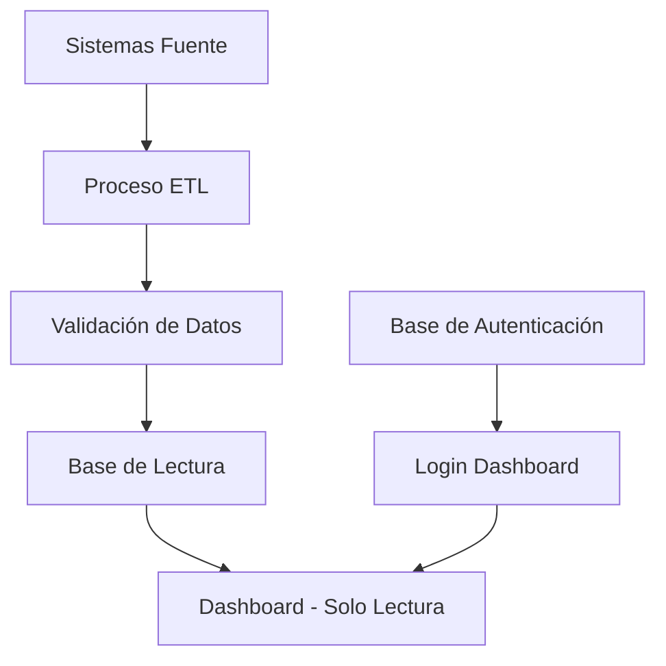

# 📊 Explicación: Cómo se Alimentan Ambas Bases de Datos

## 🔐 **Base de Datos 1: AUTENTICACIÓN**
**URL**: `https://hvhmsecjrkmlqlruznfe.supabase.co`

### **Función:**
- **Propósito**: Gestionar el acceso y autenticación al dashboard
- **Tabla principal**: `users` (para credenciales de login)
- **Operaciones**: INSERT, UPDATE, DELETE (escritura completa)

### **¿Cómo se alimenta?**
1. **Registro de usuarios**: Cuando alguien se registra en el sistema
2. **Login/Logout**: Gestión de sesiones activas
3. **Administración**: Panel admin para crear/editar usuarios
4. **APIs externas**: Sistemas que necesitan acceso al dashboard

---

## 📊 **Base de Datos 2: LECTURA DE PERFIL**
**URL**: `https://leoyybfbnjajkktprhro.supabase.co`

### **Función:**
- **Propósito**: Almacenar información detallada del perfil de usuarios
- **Tabla principal**: `users` (con datos completos del perfil)
- **Operaciones**: Solo SELECT (solo lectura)

### **¿Cómo se alimenta?**
Esta base de datos se alimenta **EXTERNAMENTE** mediante:

#### **🔄 Fuentes de Alimentación:**

1. **Sistemas ERP/CRM**
   - Datos de empleados desde sistemas corporativos
   - Información de departamentos y roles
   - Datos de contacto y ubicación

2. **Sistemas de RRHH**
   - Información personal de empleados
   - Historial laboral y habilidades
   - Datos de contratación y antigüedad

3. **APIs de Terceros**
   - Integración con LinkedIn para habilidades
   - Sistemas de gestión de talento
   - Plataformas de evaluación de desempeño

4. **Procesos ETL**
   - Extracción automática desde sistemas fuente
   - Transformación y limpieza de datos
   - Carga programada (diaria/semanal)

5. **Administración Manual**
   - Panel de administración separado
   - Actualizaciones masivas de datos
   - Corrección de información

#### **⚙️ Proceso de Sincronización:**



#### **🔒 Características de Seguridad:**
- **Solo lectura**: No se puede modificar desde el dashboard
- **Acceso controlado**: Solo la aplicación puede leer
- **Datos actualizados**: Sincronización periódica desde fuentes
- **Consistencia**: Validación de integridad de datos

---

## 🔄 **Flujo Completo de Datos**

### **1. Alimentación de la Base de Lectura:**
```
Sistema Externo → ETL Process → Base de Lectura → Dashboard
```

### **2. Autenticación:**
```
Usuario → Login → Base de Autenticación → Dashboard Access
```

### **3. Visualización de Perfil:**
```
Dashboard → Query SELECT → Base de Lectura → Mostrar Datos
```

---

## 📋 **Ejemplo Práctico:**

### **Escenario**: Nuevo empleado se incorpora a la empresa

1. **RRHH registra al empleado** en su sistema
2. **Proceso ETL** extrae los datos nightly
3. **Datos se cargan** en la base de lectura
4. **Empleado puede acceder** al dashboard (base de autenticación)
5. **Ve su perfil** con datos actualizados (base de lectura)

### **Ventajas de esta Arquitectura:**
- ✅ **Separación de responsabilidades**: Auth vs Datos
- ✅ **Seguridad**: Base de lectura protegida contra modificaciones
- ✅ **Performance**: Optimizada solo para consultas
- ✅ **Escalabilidad**: Fuentes de datos externas independientes
- ✅ **Consistencia**: Datos centralizados y validados

---

## 🎯 **Resumen:**

- **Base de Autenticación**: Se alimenta por el sistema de login/registro
- **Base de Lectura**: Se alimenta por sistemas externos (RRHH, ERP, APIs)
- **Dashboard**: Solo **LEE** de la base de perfil, **ESCRIBE** en la base de auth
- **Sincronización**: Procesos automáticos mantienen los datos actualizados